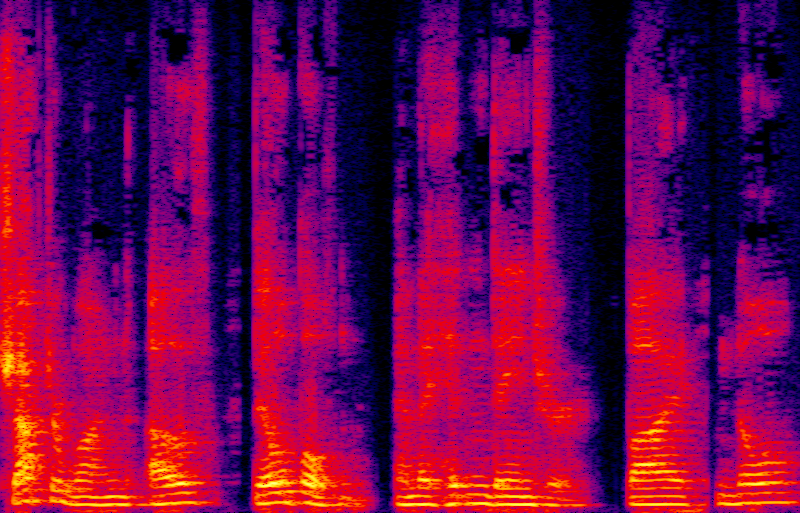
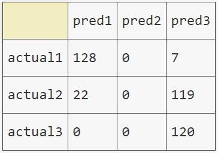

# Capstone Project - Speaker Classification

# Executive Summary
We see voice being used more and more in our daily devices, whether it be to get information on traffic, order pizza, or to hear a lame joke. A number of these systems now have speaker recognition and devices like the Google Home and Amazon Alexa can respond to each user accordingly.
The objective of my project was to be able to create a system that could classify the voices of three people at a rate better than chance. I was hoping for classification model to have an accuracy of at least 60%. 
 I found a [blog](https://towardsdatascience.com/automatic-speaker-recognition-using-transfer-learning-6fab63e34e74) that outlined a method for doing such a task. They also provided to links to open source audiobooks they had downloaded for their model.

## Data
I downloaded the zip files of around 100 audiobooks, all of which were split up in chapters. Audiobooks are ideal audio sources since they consist of single speaker speaking for hours with little to no noise.
    
## Processing
For processing each audiobook I followed this process. I used command line tools like ffmpeg, sox, and mp3wrap.

1.Using mp3wrap, combine audio files from a single book since they were split up into chapters. 
2.Using ffmpeg, cut each audio file down to 45min 
3.Using ffmpeg, convert each audio file from mp3 to wav. 
4.Remove silence longer than 0.5 seconds using sox. 
5.Split each wav file into 5 second segments using ffmpeg. 
6.Convert each segment into a spectrogram using sox to input into a convolutional neural network . A spectrogram is a visual representation of a spectrum of frequencies of over time. As shown below. 
 

</img>
    
## Modeling
For modeling I used a Convolutional Neural Network trained on six people, then I used transfer learning to take features extracted from the CNN to use as inputs for an SVM model. 

## Limitations
I was hoping to train the model on at 50 audiobooks but due to time-constraints and memory issues, I was unable to process all the audio spectorgrams. 

## Results
After training the CNN on spectrograms from 6 people, I got a training accuracy of 99% and a validation accuracy of 88%. 
Using this trained CNN as a feature extractor, I used an SVM to learn the features of 3 new speakers from different audio books. The results came to around 62% but that was because the second speaker was severely misclassified.  

</img>    
 

You can see that the predictions for the 1st and 3rd speaker are pretty good, but the 2nd speaker never gets classified.
    
    
    
